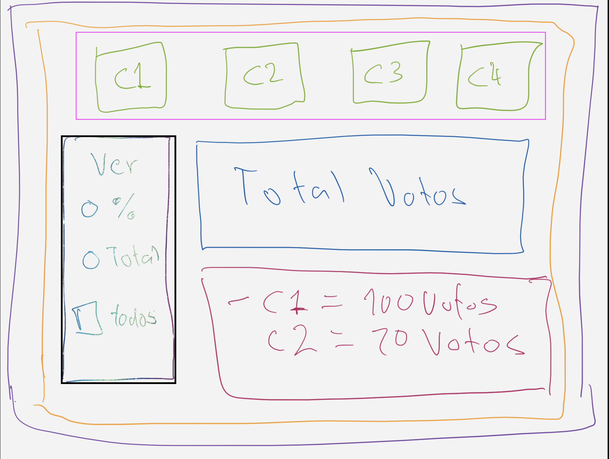

# Sistema de votaciones

Vamos a realizar un ejercicio que nos ayude a familiarizarnos con la estructura de multiples componentes en React y la comunicación entre ellos, para ello vamos a crear un sistema de votaciones.

## Componentes
- App - Yellow
- Candidate Vote - Green
- Candidates (Lista de candidatos) - Fuchsia
- Total Votes (Total de votos de todos los candidatos) - Blue
- Config (Configuración de como se presentan los resultados) - Black
- Results (Resultados de las votaciones) - Red

## Imagen Referencial

## Requerimientos
- El componente `App` debe contener los componentes Candidate Vote, Candidates, Total Votes, Config y Results.
- El sistema tendra 4 candidatos.
- Cada candidato sera un componente que debera permitir realizar el voto por el candidato correspondiente (Button).
- Un component `TotalVotes` que debe mostrar el numero total de votos.
- Componente `Results` que debera mostrar el resultado de los votos de forma individual de los candidatos. Estos pueden ser en numero o porcentaje, dependiendo del filtro que el usuario elija en el componente `Config`.
- Componente `Config` es un filtro el cual va permitir al usuario mostrar si quiere ver los resultuados indivudales de forma porcentual o numerica (totales).
- El sistema debe calcular el porcentaje para cada candidato de forma automatica cada que se agregue un nuevo voto.
