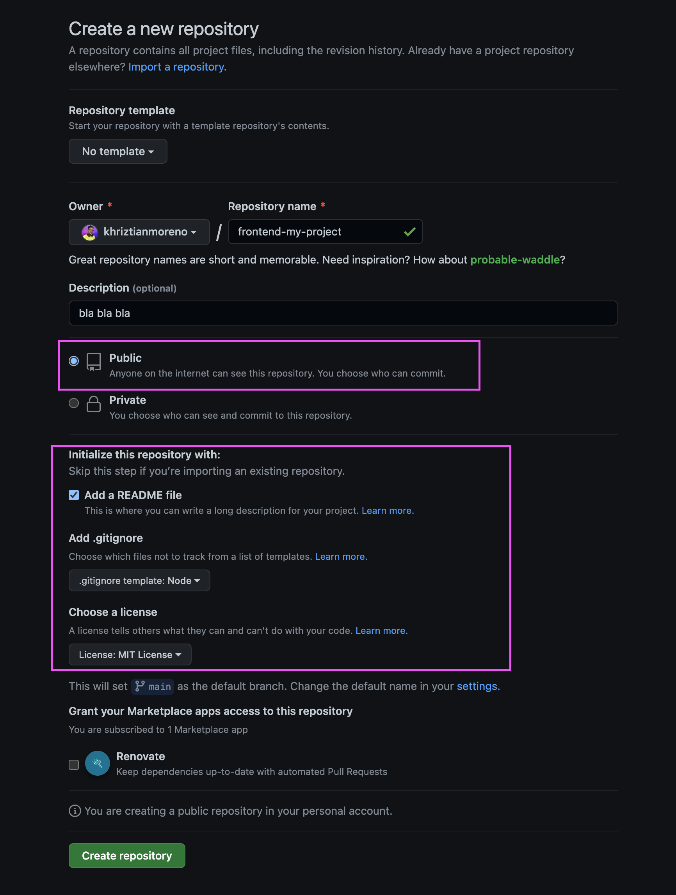
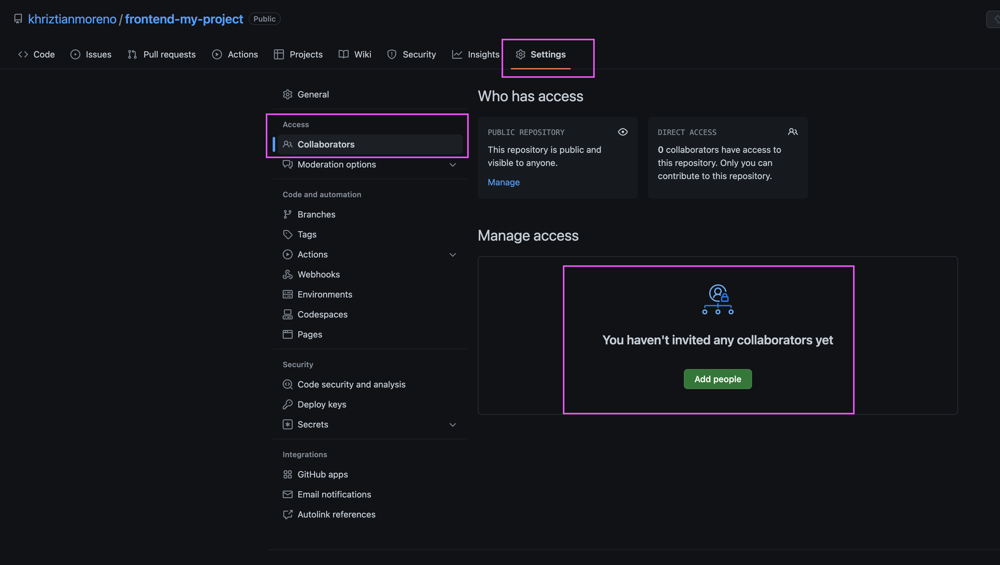
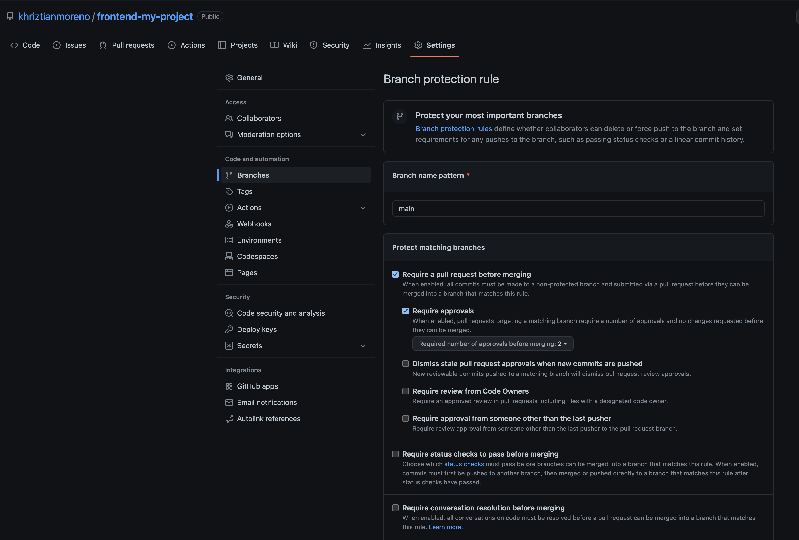
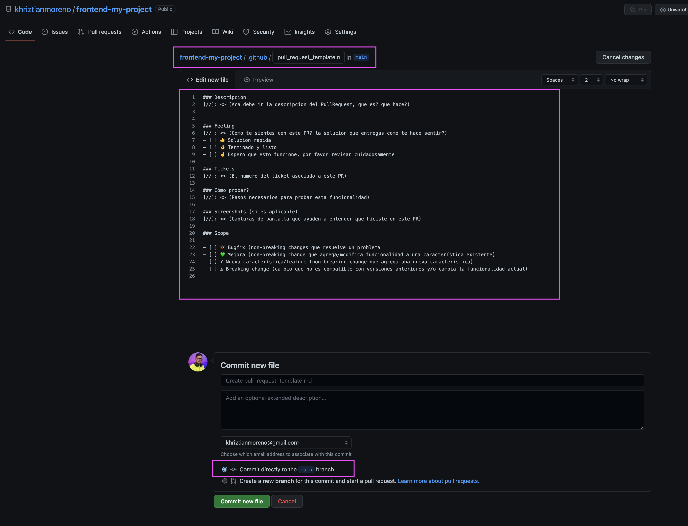
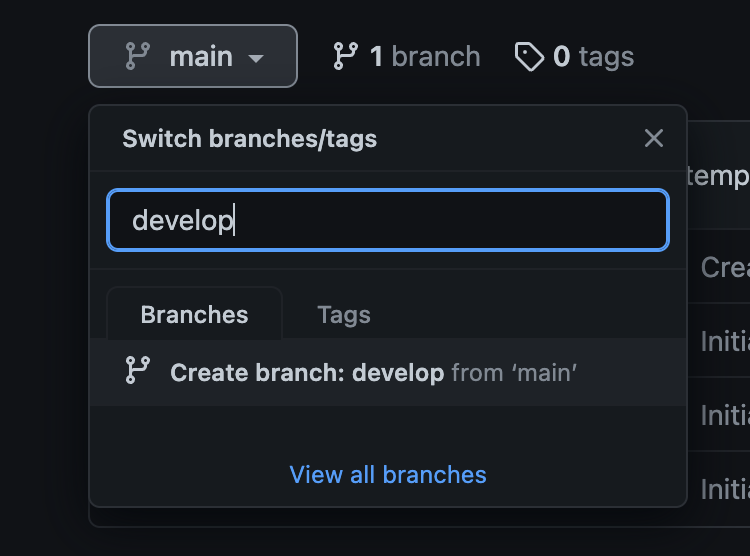
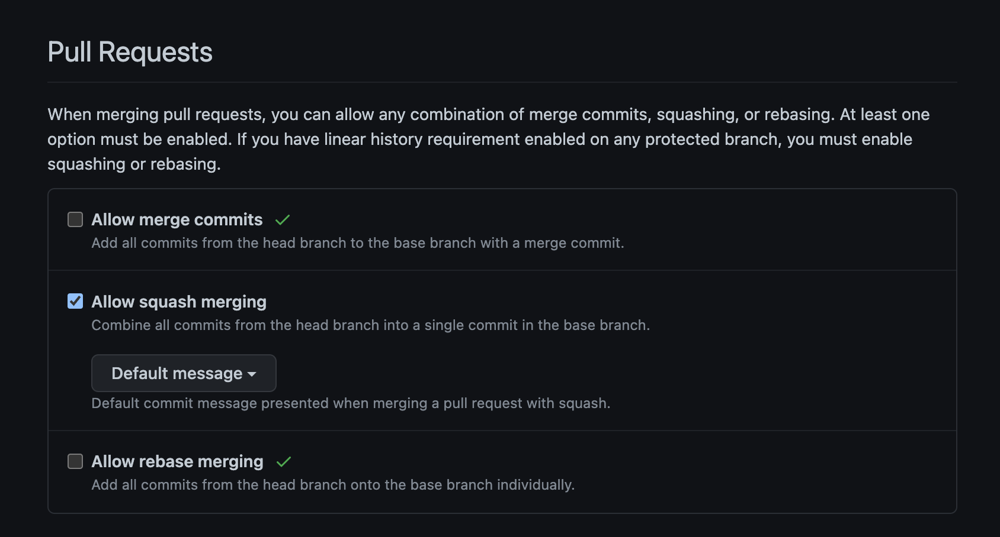

# Proyectos
> Guia para la creación de proyectos grupales

Es de recordar que estos pasos los van a realizar en equipo y tendra como resultado un proyecto que se entregara en el sprint __.

## Lista de Proyectos

- [Hotel Booking](./hotel-booking/)
- [NFT Marketplace](./nft-marketplace/)
- [Medical Health](./medical-health/)


## Repositorios del proyecto
Crear 2 repositorios en GitHub con el nombre del proyecto, `frontend-nombre-proyecto` y `backend-nombre-proyecto`. Seguir estos pasos para cada uno de los repositorios.

1. Ir a github.com y crear un repositorio nuevo.
2. Crear un archivo README.md en el repositorio.
3. Crear un archivo .gitignore en el repositorio.
4. Crear un archivo LICENSE en el repositorio. Licencia MIT.



5. Agregar a los colaboradores del proyecto. Los colaboradores son los integrantes del equipo.



6. Proteger la rama main para que no se pueda hacer push directamente. Para esto, ir a `Settings` y en la sección `Branches` seleccionar `Add rule` y seleccionar `main` como rama y `Require pull request reviews before merging` como opción.



7. Crear un archivo `.github/pull_request_template.md` en el repositorio con el siguiente contenido:

```
### Descripción
[//]: <> (Aca debe ir la descripcion del PullRequest, que es? que hace?)


### Feeling
[//]: <> (Como te sientes con este PR? la solucion que entregas como te hace sentir?)
- [ ] 🤙 Solucion rapida
- [ ] 👌 Terminado y listo
- [ ] 🤞 Espero que esto funcione, por favor revisar cuidadosamente

### Tickets
[//]: <> (El numero del ticket asociado a este PR)

### Cómo probar?
[//]: <> (Pasos necesarios para probar esta funcionalidad)

### Screenshots (si es aplicable)
[//]: <> (Capturas de pantalla que ayuden a entender que hiciste en este PR)

### Scope

- [ ] 🐞 Bugfix (non-breaking changes que resuelve un problema
- [ ] 💚 Mejora (non-breaking change que agrega/modifica funcionalidad a una característica existente)
- [ ] ⚡️ Nueva característica/feature (non-breaking change que agrega una nueva característica)
- [ ] ⚠️ Breaking change (cambio que no es compatible con versiones anteriores y/o cambia la funcionalidad actual)

```



8. Crear una rama `develop` en el repositorio. Esta rama será la rama de integracion de todos los Pull Request del proyecto en el proceso de desarrollo.

Pueden hacerlo directamente en github o desde la terminal con el siguiente comando:

```bash
git checkout -b develop
```



9. Modificar los pull request para que solo permitan hacer `squash and merge` y no `merge commit`. Para esto, ir a `Settings`, luego `General` y en la sección `Pull Requestsn` seleccionar `Allow squash merging` unicamente.



## Jira del proyecto

1. Ir a jira.com y crear un nuevo proyecto. El nombre del proyecto debe ser el mismo que el nombre del repositorio de backend.
2. Crear un nuevo board para el proyecto. El nombre del board debe es libre.
3. Invitar a los integrantes del equipo al proyecto.
4. Crear un nuevo issue para indicar la creacion de los repositorios. El nombre del issue debe ser el nombre del repositorio. Los issues deben ser creados en el board creado en el paso anterior. El issue debe tener como tipo `Task` y como prioridad `Medium`. El issue debe tener como descripcion el link al repositorio creado en GitHub. El issue debe tener como asignado a cada integrante del equipo.
5. Los demas issues seran creados por los integrantes del equipo de acuerdo a la descripcion del proyecto entregada por el mentor. Cada integrante del equipo debe crear minimo 10 issues, estos deben ser descritos a modo de Historia de Usuario.


