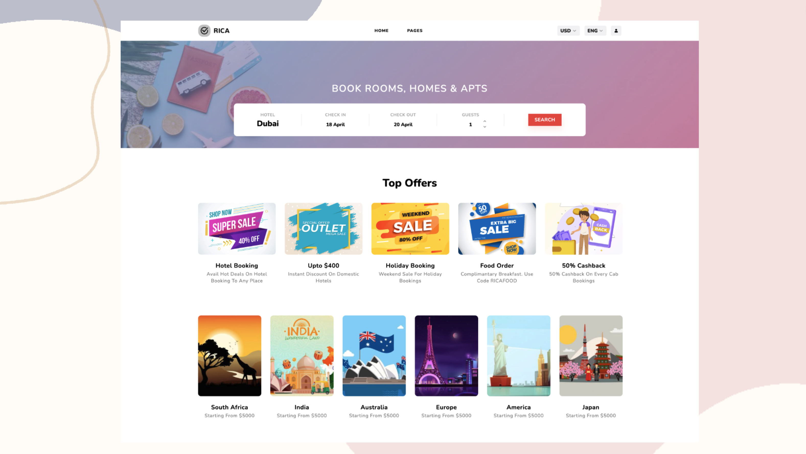

# Make It Real - Hotel Booking

## Descripción

La aplicación le permite a los usuarios buscar y reservar alojamientos que publican los administradores del sistema. Los usuarios pueden buscar alojamientos por ciudad, fecha de entrada y fecha de salida. Los administradores pueden publicar alojamientos y ver las reservas que se han hecho.

Puedes usar cualquier herramienta que te guste para ayudarte a completar el proyecto.

**Tus usuarios deberían poder:**

- Registrarse.
- Ingresar / Salir.
- Cambiar contraseña.
- Recuperar contraseña.
- Buscar hotel minimamante por ciudad (mapa y listado).
- Ver los detalles de un hotel.
- Reservar hotel en un rango de fechas y hacer el pago.
- Recibir al correo electronico la informacion de su reserva.
- Ver las reservas que ha hecho.
- Ver el diseño óptimo para el componente según el tamaño de pantalla de su dispositivo.

**Los administradores del sistema deberían poder:**

- Ingresar / Salir.
- Administrar los hoteles (Crear, actualizar, borrar).
- Ver reservas.

**Un hotel tiene al menos:**

- Un título.
- Un acerca de.
- Una ubicación (ciudad, lat-lng, direccion).
- Unas imágenes.
- Rooms.
- Lista de facilities.
- Contact Info.
- Número de camas.
- Precio por noche.

**Una habitacion tiene al menos:**

- Un título.
- Una descripción.
- Un precio por noche.
- Imagenes.
- Lista de Amenities.

**Tecnologias:**

- React
- Redux
- React Router
- React Hooks
- Node.js
- Express
- MongoDB
- Mongoose
- JWT
- Bcrypt
- Cloudinary

#### El Proyecto Grupal debe tener:

- Desarrollar y lograr que se parezca lo más posible al diseño.
- Deben tener minimamente 2 roles de usuario (admin y usuario).
- Debe ser responsive (mobile first).
- Registro y autenticación de usuarios.
- Almacenar información en una base de datos (MongoDB).
- El backend debe estar implementado en Node.js (Express) y el frontend en React.
- Debe incluir carga de imágenes y envío de correos.
- Debe tener al menos una de las siguientes funcionalidades:
    - Pagos
    - Tiempo Real (Web Sockets).
- Debe estar desplegada en Internet (Netllify, Heroku, Vercel)
- Debe al menos tener pruebas end-to-end con Cypress.

## Diseño

Los diseños están en formato PNG estático. El uso de archivos PNG significará que deberá usar su mejor criterio para estilos como "tamaño de fuente", "padding" y "margen".

### Style Guide

Los diseños se crearon con los siguientes anchos:

- Mobile: 375px
- Desktop: 1440px

## Colores

### Primary

- Amarantha (accent): #F13F4B
- Alabaster (main background): #F9F9F9

### Neutral

- White (main cards): #FFFFFF
- Cod Gray : #1B1B1B
- Silver Chalice (text): #A1A1A1
- Black (text): #000000

## Tipografía

### Body Copy

- Font size: 15px

### Font

- Family: [Nunito](https://fonts.google.com/specimen/Nunito)
- Weights: 800, 700

**¡Diviértete construyendo!** 🚀
