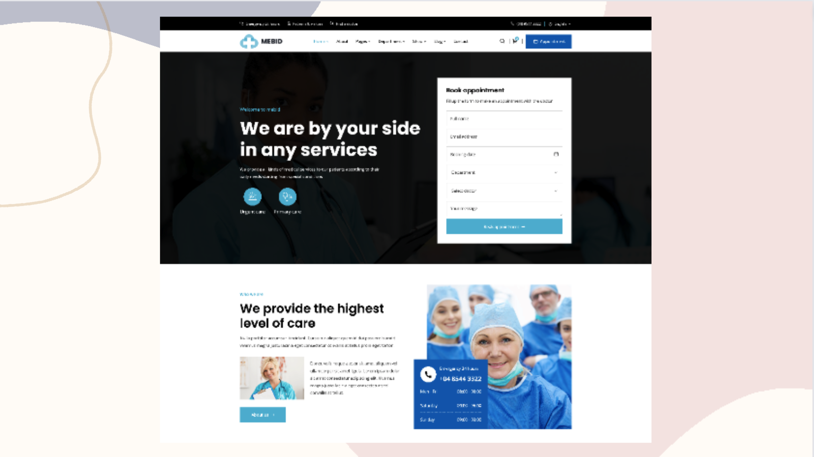

# Make It Real - Medical Health

## Descripción

La aplicación le permite a los usuarios buscar y agendar citas medicas con un doctor en particular, ademas los usuarios pueden buscar doctores por especialidad, o disponibilidad en fecha. Los doctores pueden ver la informacion de las citas agendas ademas de poder aceptarlas, rechazarlas o aplazarlas para una proxima fecha.

Puedes usar cualquier herramienta que te guste para ayudarte a completar el proyecto.

**Tus usuarios deberían poder:**

- Registrarse.
- Ingresar / Salir.
- Cambiar contraseña.
- Recuperar contraseña.
- Buscar un doctor.
- Ver los detalles de un doctor.
- Agendar una cita con un doctor en particular y hacer el pago.
- Recibir al correo electronico la informacion de su cita.
- Ver las citas que ha hecho.
- Ver productos medicos que se venden en la plataforma.
- Ver el diseño óptimo para el componente según el tamaño de pantalla de su dispositivo.

**Los doctores deberían poder:**

- Ingresar / Salir.
- Ver sus citas agendadas.
- Ver los detalles de una cita.
- Cancelar una cita.
- Ver los productos medicos que se venden en la plataforma.

**Una cita tiene al menos:**

- Un paciente.
- Especialidad de la cita.
- Doctor asignado.
- Fecha.
- Motivo de la consulta.
- Precio por la cita.

**Una paciente tiene al menos:**

- Nombre.
- Email.
- Numero de telefono.
- Nacionalidad.
- Imagen de perfil.
- Genero
- Fecha de nacimiento.
- Tipo de sangre.

**Tecnologias:**

- React
- Redux
- React Router
- React Hooks
- Node.js
- Express
- MongoDB
- Mongoose
- JWT
- Bcrypt
- Cloudinary

#### El Proyecto Grupal debe tener:

- Desarrollar y lograr que se parezca lo más posible al diseño.
- Deben tener minimamente 2 roles de usuario (admin y usuario).
- Debe ser responsive (mobile first).
- Registro y autenticación de usuarios.
- Almacenar información en una base de datos (MongoDB).
- El backend debe estar implementado en Node.js (Express) y el frontend en React.
- Debe incluir carga de imágenes y envío de correos.
- Debe tener al menos una de las siguientes funcionalidades:
    - Pagos
    - Tiempo Real (Web Sockets).
- Debe estar desplegada en Internet (Netllify, Heroku, Vercel)
- Debe al menos tener pruebas end-to-end con Cypress.

## Diseño

Los diseños están en formato PNG estático. El uso de archivos PNG significará que deberá usar su mejor criterio para estilos como "tamaño de fuente", "padding" y "margen".

### Style Guide

Los diseños se crearon con los siguientes anchos:

- Mobile: 375px
- Desktop: 1440px

## Colores

### Primary

- Scooter: #3FB6D6
- Blue Ribbon: #0D6EFD

### Neutral

- White: #FFFFFF
- Black (text): #000000

## Tipografía

### Body Copy

- Font size: 15px

### Font

- Family: [Poppins](https://fonts.google.com/specimen/Poppins)
- Weights: 600

- Family: [Open Sans](https://fonts.google.com/specimen/Open+Sans)
- Weights: 400

**¡Diviértete construyendo!** 🚀
