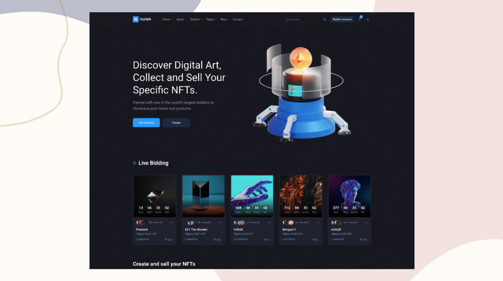

# Make It Real - NFT Marketplace

## Descripción

Nuron es un mercado NFT, le permite a los usuarios buscar, crear y comprar los tokens no fungibles. Los administradores pueden administrar los NFT y cuenta de usuario, asi como conocer las ganacias obtenidas por la comision de cada token vendido.

Puedes usar cualquier herramienta que te guste para ayudarte a completar el proyecto.

**Tus usuarios deberían poder:**

- Registrarse.
- Ingresar / Salir.
- Cambiar contraseña.
- Recuperar contraseña.
- Crear un NFT.
- Buscar NFT's minimamante por categoria y precio.
- Ver los detalles de un NFT.
- Hacer una oferta por un NFT.
- Comprar un NFT y hacer el pago mediante pasarela de pagos.
- Recibir al correo electronico la informacion de su NFT comprado.
- Ver la colección de sus NFTs adquiridos.
- Ver el diseño óptimo para el componente según el tamaño de pantalla de su dispositivo.

**Los administradores del sistema deberían poder:**

- Ingresar / Salir.
- Administrar los usuarios (Crear, actualizar, borrar).
- Administrar los NFT de los creadores (Listar, borrar).
- Conocer las ganancias obtenidas por la comision de cada token vendido.

**Un NFT tiene al menos:**

- Un nombre.
- Un descripción.
- Precio.
- Unas imágenes.
- Tamaño.
- Categorias.
- Autor.
- Fecha de creación.
- Estado (vendido, disponible, en oferta).

**Tecnologias:**

- React
- Redux
- React Router
- React Hooks
- Node.js
- Express
- MongoDB
- Mongoose
- JWT
- Bcrypt
- Cloudinary

#### El Proyecto Grupal debe tener:

- Desarrollar y lograr que se parezca lo más posible al diseño.
- Deben tener minimamente 2 roles de usuario (admin y usuario).
- Debe ser responsive (mobile first).
- Registro y autenticación de usuarios.
- Almacenar información en una base de datos (MongoDB).
- El backend debe estar implementado en Node.js (Express) y el frontend en React.
- Debe incluir carga de imágenes y envío de correos.
- Debe tener al menos una de las siguientes funcionalidades:
    - Pagos
    - Tiempo Real (Web Sockets).
- Debe estar desplegada en Internet (Netllify, Heroku, Vercel)
- Debe al menos tener pruebas end-to-end con Cypress.

## Diseño

Los diseños están en formato PNF estático. El uso de archivos PNF significará que deberá usar su mejor criterio para estilos como "tamaño de fuente", "padding" y "margen".

### Style Guide

Los diseños se crearon con los siguientes anchos:

- Mobile: 375px
- Desktop: 1440px

## Colores

### Primary

- Azure Radiance (main color): #00A3FF
- Cinder (main background): #13131D
- Cloud Burst (accent): #212E48

### Neutral

- White (main cards): #FFFFFF
- Wild Sand : #F6F6F6
- Silver Chalice (text): #ACACAC
- Black (text): #000000

## Tipografía

### Body Copy

- Font size: 16px

### Font

- Family: [Roboto](https://fonts.google.com/specimen/Roboto)
- Weights: 400, 500, 700

**¡Diviértete construyendo!** 🚀
